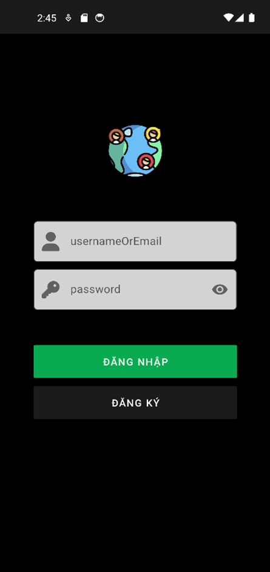
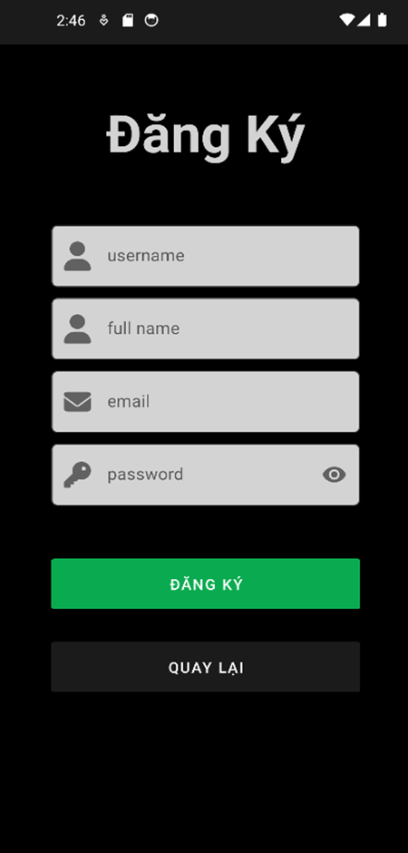
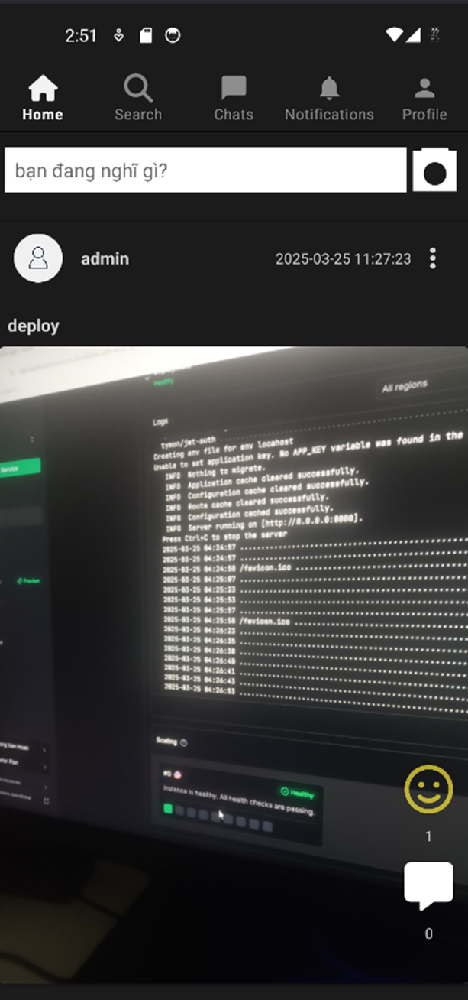
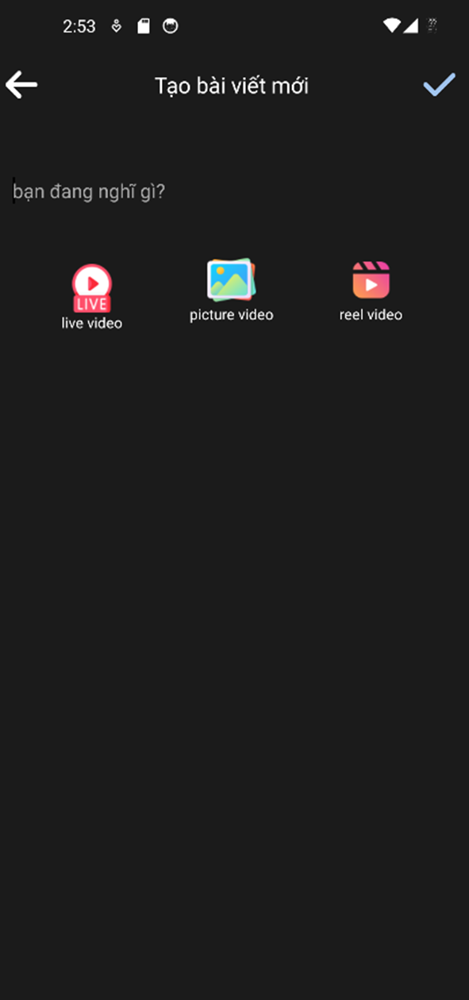
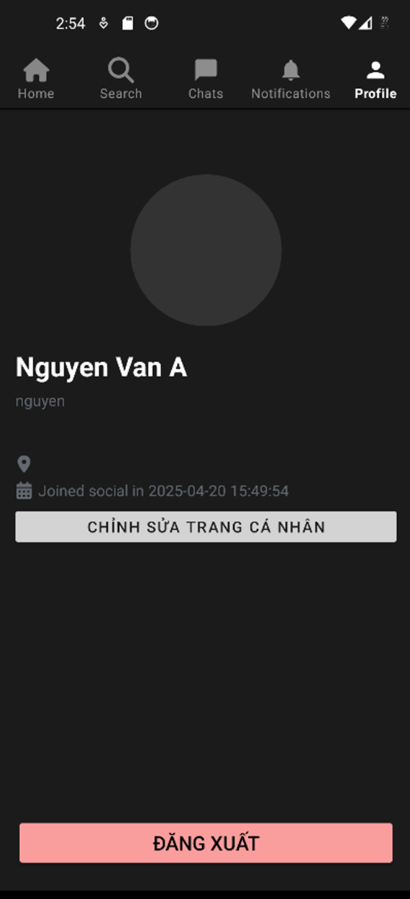
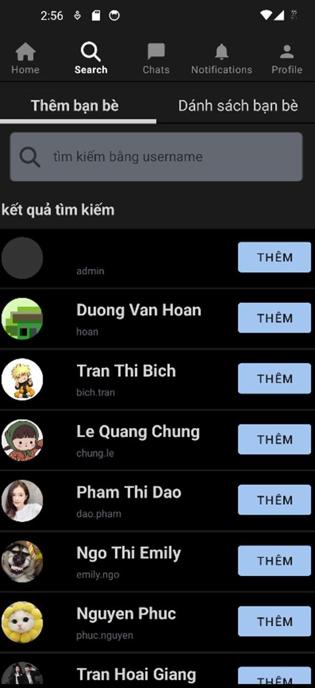

# Social Media Application

A modern social networking platform built with Laravel backend and Android (Kotlin) frontend, enabling users to connect, share, and interact in real-time.

## Description

This application is a feature-rich social networking platform that combines the robustness of Laravel for the backend with the native performance of Kotlin for the Android client. The application provides a seamless social networking experience with real-time updates and interactions.

## Key Features

### User Management

- User registration and authentication using JWT
- Profile management with customizable user information
- Profile picture upload and management
- User search and discovery

### Social Networking

- Friend request system (send, accept, reject)
- Real-time friend request notifications
- View friends list and pending requests
- User connections management

### Posts and Content Sharing

- Create and share posts with images
- Add location to posts
- View posts from friends
- News feed with latest updates
- Post content management
- Interactive reactions system

### Interaction Features

- Multiple reaction types (like, happy, sad, tired, wow, haha, love)
- Comment on posts
- Real-time notifications for interactions
- Post interaction tracking

### Messaging System

- Real-time private messaging
- Individual and group conversations
- Image sharing in messages
- Message status tracking
- Conversation management

### Real-time Features

- Live updates for messages
- Instant notifications
- Real-time post updates
- Live interaction updates

## Technologies Used

### Backend (Server)

- **Framework**: Laravel 10.x
- **Database**: MySQL
- **Authentication**: JWT (JSON Web Tokens)
- **Real-time**: Laravel WebSockets
- **File Storage**: Cloudinary
- **API**: RESTful API architecture

### Frontend (Android Client)

- **Language**: Kotlin
- **Architecture**: MVVM (Model-View-ViewModel)
- **Network**: Retrofit for API calls
- **Image Loading**: Glide/Picasso
- **Dependency Injection**: Android Hilt
- **Real-time Communication**: WebSocket client
- **UI Components**: Android Material Design
- **Async Operations**: Kotlin Coroutines

## Project Structure

### Server Structure

```
server/
├── app/
│   ├── Console/           # Console commands
│   ├── Events/           # Event classes
│   ├── Http/             # Controllers and Middleware
│   ├── Models/           # Database models
│   └── Providers/        # Service providers
├── config/               # Configuration files
├── database/
│   ├── factories/        # Model factories
│   ├── migrations/       # Database migrations
│   └── seeders/         # Database seeders
├── routes/
│   ├── api.php          # API routes
│   └── channels.php     # Broadcasting channels
└── tests/               # Application tests
```

### Android Client Structure

```
client/
├── app/
│   └── src/
│       └── main/
│           ├── java/com/hoan/client/
│           │   ├── fragment/       # UI fragments
│           │   ├── network/        # API services
│           │   ├── viewmodel/      # ViewModels
│           │   └── models/         # Data models
│           └── res/               # Resources
├── build.gradle                   # Project configuration
└── settings.gradle               # Project settings
```

## UI Screenshots



-



-



-



-



-


-



## Getting Started

### Prerequisites

- PHP 8.1+
- Composer
- MySQL 5.7+
- Android Studio
- JDK 11+
- Docker (optional)

### Installation

1. Clone the repository

```bash
git clone https://github.com/DVanhoan/social-kotlin.git
```

2. Server Setup

```bash
cd server
composer install
cp .env.example .env
php artisan key:generate
php artisan migrate
php artisan jwt:secret
```

3. Android Client Setup

```bash
cd client
./gradlew build
```
